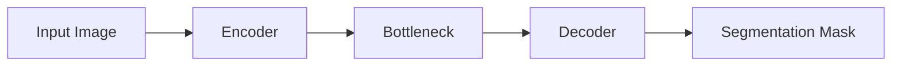
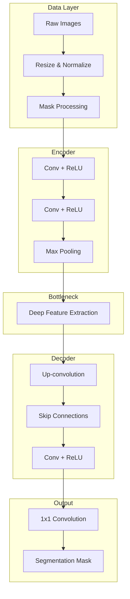

# U-Net Semantic Segmentation with TensorFlow/Keras

A deep learning project that implements the U-Net architecture for pixel-wise semantic segmentation using TensorFlow and Keras. The model performs dense prediction through an encoder–decoder network with skip connections, enabling accurate multi-class segmentation of driving scene images.

---

## Overview

This repository demonstrates how encoder–decoder architectures with skip connections enable precise localization in semantic segmentation tasks. The pipeline is designed to be modular, reproducible, and easy to extend for different segmentation datasets.

---

## Features

- End-to-end U-Net semantic segmentation pipeline  
- Efficient data pipeline using `tf.data.Dataset`  
- Multi-class segmentation with sparse categorical labels  
- Encoder–decoder architecture with skip connections  
- Visualization of predictions vs ground truth  
- Modular and educational implementation  

---

## Model & Framework

- **Model**: U-Net  
- **Framework**: TensorFlow 2.x / Keras  
- **Task**: Multi-class semantic segmentation  
- **Input Shape**: 96 × 128 × 3  
- **Output**: 96 × 128 segmentation mask  
- **Classes**: 23 semantic categories  

---

## System Architecture

### High-Level Pipeline

## Modular System Design

## Model Architecture

### Encoder (Contracting Path)
- Convolution + ReLU  
- Convolution + ReLU  
- Max Pooling  
- Feature map downsampling  

### Bottleneck
- Deep convolutional feature extraction  

### Decoder (Expanding Path)
- Transposed Convolution (Upsampling)  
- Skip connections from encoder  
- Convolution + ReLU  

### Output Layer
- 1×1 Convolution  
- Pixel-wise class prediction (logits)  

- **Loss Function**: Sparse Categorical Crossentropy (from logits)  
- **Optimizer**: Adam  

---

## Dataset

- **Source**: CARLA Driving Simulator  
- **Inputs**: RGB images  
- **Targets**: Pixel-wise segmentation masks  

### Preprocessing
- Resize images to 96 × 128  
- Normalize pixel values  
- Reduce mask channels to class indices  

---

## Training Configuration

- Epochs: 40  
- Batch Size: 32  
- Shuffle Buffer Size: 500  
- Optimizer: Adam  
- Loss: Sparse Categorical Crossentropy  

---

## Training Pipeline

1. Load dataset using `tf.data`  
2. Apply preprocessing (resize, normalize, mask transform)  
3. Build U-Net architecture  
4. Compile model with optimizer and loss  
5. Train model on dataset  
6. Monitor accuracy and loss  

---

## Evaluation & Visualization

- Visual comparison of:
  - Input images  
  - Ground truth masks  
  - Predicted masks  

- Training metrics:
  - Accuracy trends  
  - Loss curves  

- Batch-wise prediction inspection  
